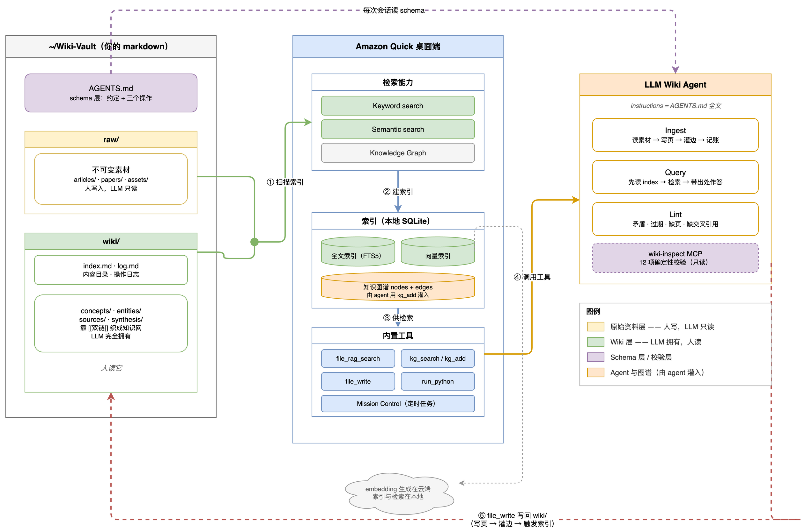

# LLM Wiki on Amazon Quick

在 [Amazon Quick](https://aws.amazon.com/quick/) 桌面端跑一套 [Karpathy 的 LLM Wiki](https://gist.github.com/karpathy/442a6bf555914893e9891c11519de94f) —— 不装向量数据库、不装 embedding 运行时、不装图数据库。

> **LLM Wiki 的思路是先编译，后查询。** 素材导入后 LLM 提前完成提取、整合、关联，产出一套互相链接的 markdown 维基，查询直接读它。新增资料时自动更新已有词条、标记冲突 —— 知识持续变厚，而不是每次从零推导。



## 这个仓库提供什么

| 目录 | 内容 |
|---|---|
| **`scaffold/`** | 目录骨架 + `AGENTS.md`（schema 层：约定 + 三个操作 + 校验规程），`cp -R` 就能用 |
| **`agent/`** | 把 `AGENTS.md` 做成常驻 Quick agent 的完整说明 |
| **`mcp/wiki-inspect/`** | 只读内省 MCP：4 个工具补上 Quick 内置工具读不到的三处 |
| **`skill/quick-wiki-ops/`** | Claude Code 的操作手册 + 独立校验脚本（12 项确定性检查） |
| **`examples/`** | 一次真实运行的完整产出：62 页 / 316 条边 / 零死链 |
| **`docs/`** | 抽取规则模板、定时任务 prompt、架构图源文件 |

## 快速开始

**前置**：Amazon Quick 桌面应用，Pro 或以上订阅。

### 1. 铺骨架

```bash
git clone https://github.com/brilliantwf/llm-wiki-on-quick.git
cp -R llm-wiki-on-quick/scaffold/ ~/Wiki-Vault/
```

```
~/Wiki-Vault/
├── AGENTS.md              schema 层：约定 + 三个操作 + 校验规程
├── raw/                   不可变素材（人写，LLM 只读）
│   ├── articles/  papers/  assets/
└── wiki/                  LLM 拥有
    ├── index.md           内容目录
    ├── log.md             操作日志
    ├── concepts/          抽象：模式、协议、方法
    ├── entities/          具体：产品、服务、人、工具
    ├── sources/           素材摘要页
    └── synthesis/         解读、对比、问答归档
```

### 2. 注册三个文件夹

**Settings → Capabilities → My Computer → Local Folders → Add folder**

| # | 路径 | Agent access | Keyword | Semantic | KG |
|---|---|---|---|---|---|
| 1 | `~/Wiki-Vault` | ✓ 锁定开 | ✗ | ✗ | ✗ |
| 2 | `~/Wiki-Vault/raw` | ✓ 锁定开 | **✓** | ✗ | ✗ |
| 3 | `~/Wiki-Vault/wiki` | ✓ 锁定开 | **✓** | **✓** | ✗ |

**顺序有讲究**：先注册根（索引全关）→ 再加 `raw` 和 `wiki`。反过来会被拒
（`Cannot enable indexing: subfolder X is already indexed`）。

三条约束：

- **根目录索引全关**，只要 Agent access —— 它给 agent 读写整棵树的权限
- **Semantic 是 Keyword 的升级档**，不能单独开 —— 勾 Semantic 前必须先勾 Keyword
- **KG 不勾** —— 知识图谱**要用**，但不靠 Quick 的自动抽取，由 agent 在写页时用
  `kg_add` 显式灌。wiki 页的实体名、类型、摘要都由 frontmatter 定死了，一文件一实体，
  自动抽取只会额外产出正文术语的碎片节点，把已经清晰的结构搅乱。
  关掉开关不影响已有的图 —— 它只管扫描时要不要自动抽取

### 3. 建 Quick agent

```
建一个 agent，名字叫「LLM Wiki Agent」。
instructions 用 ~/Wiki-Vault/AGENTS.md 的全文，原样放进去，不要改写、不要精简。
```

它能直接读那个文件（根目录有 Agent access）。`instructions` 上限 50000 字符，
`AGENTS.md` 约 8000。**建完记得 publish** —— 新建的可能只是本地草稿。

配套字段和完整说明见 [agent/README.md](agent/README.md)。

### 4. 装 wiki-inspect MCP（建议）

```bash
mkdir -p ~/.quickwork/mcp-servers/wiki-inspect
cp mcp/wiki-inspect/server.py ~/.quickwork/mcp-servers/wiki-inspect/
```

导入 `mcp/wiki-inspect/import-wiki-inspect.json`，或直接改
`~/.quickwork/profiles/<profile>/mcp_config.json`。重启 Quick 后验证：

```
跑一次 wiki_lint
```

⚠️ **一个 JSON 只能放一个 server** —— Quick 的导入器只读 `mcpServers` 的第一个 key。
详见 [mcp/wiki-inspect/INSTALL.md](mcp/wiki-inspect/INSTALL.md)。

## 跑起来

放一份素材进 `raw/articles/`，选中 agent：

```
ingest raw/articles/<文件名>
```

它会先讨论要点等你确认，然后一口气做完：写摘要页 → 建 concept/entity 页 →
解读进 `synthesis/` → 更新 `index.md` → 追加 `log.md` → 灌边 → 触发索引。

之后：

```
<直接提问>          # Query：先读 index 定位，再检索，答案带出处
跑一次 Lint         # 体检，只报告不动手
自动 ingest <文件>   # 跳过讨论直接做（批量灌入时用）
```

## 三个操作

| 操作 | 做什么 |
|---|---|
| **Ingest** | 读素材 → 产出摘要 → 同步更新全部关联词条。一份文档往往触发十余个页面的修改 |
| **Query** | 检索 Wiki 页面生成回答。优质结论直接写回知识库，把对话产出固化为知识 |
| **Lint** | 定期体检。排查内容矛盾、过时论断、孤立页面，挖掘信息缺口 |

Lint 有两条路，各管一半：

```bash
# 确定性校验（12 项）—— 脚本或 MCP
python3 skill/quick-wiki-ops/scripts/quick_wiki_lint.py
python3 skill/quick-wiki-ops/scripts/quick_wiki_lint.py --strict   # 有问题退出码 1
```

```
# 语义判断（5 项）—— 只有 LLM 能做
跑一次 Lint
```

**两条路都要跑**：脚本负责能精确判定的部分（计数、字段、链接完整性），
agent 负责需要读懂内容才能判断的部分（矛盾、过时、缺口）。互为对照 ——
任何一边单独用都会漏。

## 检索怎么用

| 要找什么 | 用什么 | 为什么不用别的 |
|---|---|---|
| 内容（按意思找） | `file_rag_search` | `kg_search(semantic)` 只检索实体的**那一句** summary |
| 按页面类型筛 | `kg_search(category="Concept")`，支持多值 | `folder_path` 存注册路径，整个 `wiki/` 一行、值都一样 |
| 谁引用了 X | 全文检索 `[[X]]` 字面量 | `kg_search` 的 edges 有 **3 条上限**，枢纽页会被截断 |

**语义检索是必需项。** 用日常说法提问时（「一个 agent 想让另一个 agent 帮它干活，
怎么找到对方」），字面词往往在全库一次都没出现过，关键词检索必然空手而归 ——
只有语义检索能落到正确的页上。

## 关于 MCP

**核心流程零 MCP 依赖。** `kg_search` / `kg_add` / `kg_edit` / `file_rag_search` /
`file_write` / `run_python` 全是 Quick 桌面端**内置**的。

有一处措辞容易误解：`run_python` 的 `tools` 参数，官方说「可注入 MCP 工具」，
实际注入的是**当前会话可用的任何工具**，内置的也算：

```python
run_python(
  code='...',
  tools=["kg_search", "kg_add", "kg_edit"]   # ← 注入内置的 kg_* 工具
)
```

不需要配任何 server。传了之后它们在 Python 命名空间里变成同步函数，
「解析文件 → 查库现状 → 算差集 → 批量写入」能在一次调用里闭环，
**数据不经过对话上下文**。

**唯一需要自建 MCP 的是内省层**，因为内置工具有三处读不到：

| 缺口 | MCP 工具 |
|---|---|
| 边的元数据 | `wiki_edges()` |
| 索引时间戳（判断索引是否滞后） | `wiki_index_status()` |
| `kg_search` 的 3 条边上限（枢纽页被截断） | `wiki_edges("<页名>")` 拿全量 |

把校验收进一次工具调用，比让 agent 现场写代码逐页查更省 token、也更稳定。

**内省层坚持只读** —— 校验只读取状态，从不写入。写操作一律走 `kg_add` / `file_write`，
让 Quick 自己维护索引和计量。四个工具不执行外部命令、不联网、SQL 全参数化，
`vault` 参数限定在注册过的目录内 —— 详见
[mcp/wiki-inspect/TOOLS.md](mcp/wiki-inspect/TOOLS.md#安全边界)。

## 一次完整运行的产出

一次完整运行（11 份素材：Karpathy gist、Bush 1945、MCP 规范、A2A 规范、
AWS Agent Registry 公告、AgentCore 服务簇/Runtime/Gateway 官方文档等）：

| | |
|---|---|
| 内容页 | **62** |
| `linksTo` 边 | **316** |
| 死链 | **0** |
| lint | 12 项全绿 |

产出全部在 [`examples/`](examples/) 下，可以直接对照。


## 已知限制

- **内容要过云端做 embedding** —— 合规上要求笔记不出本机的话，这套方案不适用
- **索引不是实时的** —— 按 `Scan interval` 定时扫描（默认 30 分钟）。
  所以写页后要显式触发索引
- **多端不同步索引** —— Quick 的本地文件夹索引每端各自建。多端场景把 markdown
  放进云盘，各端指向同一目录、各自索引一遍
- **KG 抽取的 `special_instructions` 是软约束** —— 若自行开启 KG，抽取器不保证
  遵守你写的规则，产出需要人工校正

## 目录说明

```
llm-wiki-on-quick/
├── scaffold/                  cp -R 到 ~/Wiki-Vault/
│   ├── AGENTS.md              schema 正本
│   ├── raw/{articles,papers,assets}/
│   └── wiki/{index,log}.md + {concepts,entities,sources,synthesis}/
├── agent/README.md            建 Quick agent 的完整步骤 + instructions 全文
├── mcp/wiki-inspect/
│   ├── server.py              4 个只读工具
│   ├── INSTALL.md             安装 + 排查
│   ├── TOOLS.md               工具说明
│   └── import-wiki-inspect.json
├── skill/quick-wiki-ops/      Claude Code 用
│   ├── SKILL.md               操作手册：工具分工、豁免清单、避坑
│   └── scripts/quick_wiki_lint.py
├── examples/                  一次真实运行的 62 页产出
└── docs/
    ├── sync-task-prompt.md        定时任务 prompt
    └── images/architecture.*      架构图（含 .drawio 源）
```

## 参考

- [Andrej Karpathy — `llm-wiki.md`](https://gist.github.com/karpathy/442a6bf555914893e9891c11519de94f)（2026-04）
- [What is Amazon Quick?](https://docs.aws.amazon.com/quick/latest/userguide/what-is.html)
- [Connectors（桌面端）](https://docs.aws.amazon.com/quick/latest/userguide/connections-desktop.html)
- [Skills and agents（桌面端）](https://docs.aws.amazon.com/quick/latest/userguide/skills-and-agents-desktop.html)

## License

MIT
